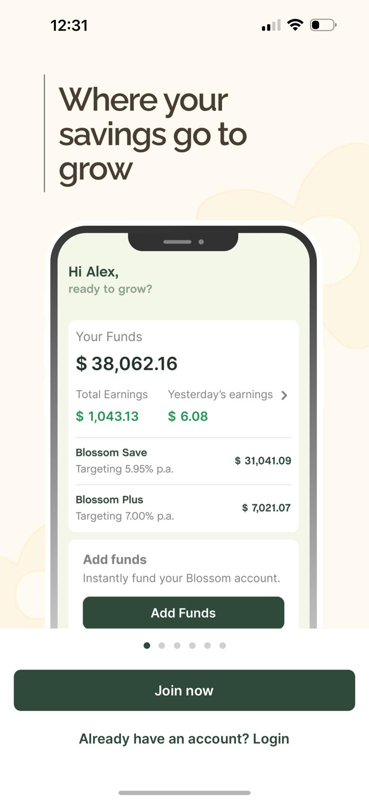
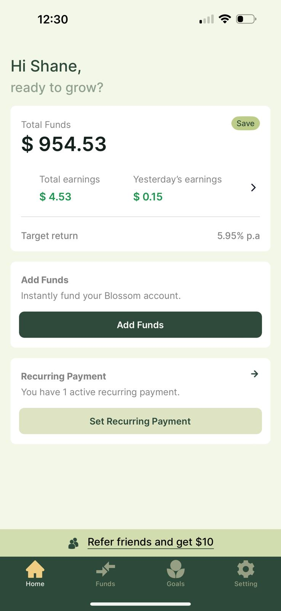
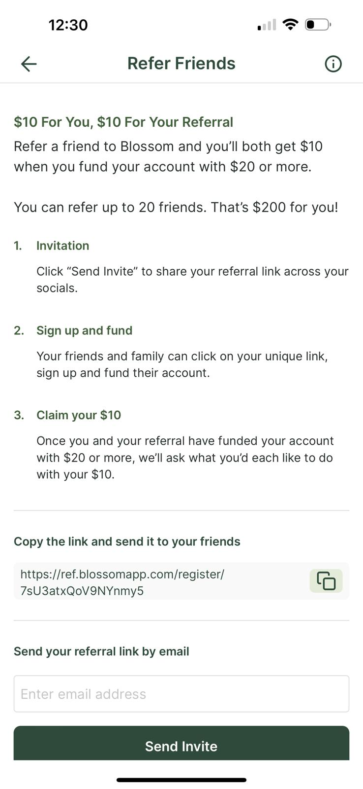

Last year I decided to open bank accounts for my kids aged 7 and 10. I thought it’s time to introduce them to and teach them about banking, savings and especially earning interest. Just opening these bank accounts at a big four bank was an administrative ordeal that I’m not just ready to talk about… 

I deposited their $15 per week each into their respective transactional accounts and linked a savings account where the remaining funds after they had spent some were deposited. The savings accounts earned minimal interest, as savings accounts do – the variable base rate on their NAB Reward Saver was 0.35% and the variable bonus rate of 4.65%. Totalling a 5.00%, not an awful rate. 

But this assumes you add money to and don’t withdraw funds to earn the variable bonus rate. 

I’ve recently I came across Blossom (https://www.blossomapp.com/)  

 **Blossom offers two pretty cool features:** 

1. **The offer just two products:** The two products are segmented based on account value, less than $5,000 you use Blossom Save and earn 5.59% and if you have above $5,000 you can invest in Blossom Plus earning 7.00%. Of course, you could have more in Blossom Save earning 5.95% interest too. 

2. **They pay interest into your account daily.** This is the feature that has my kids super interested in savings. Each day they ask me to log in to check their balance (which is combined and, in my name) and the daily interest they’ve earned. As you can see, they earn a whopping 15c a day at the moment. But it’s paid out (or should I say) added to their balance daily. My kids can see their savings growing each day. 

 I’ve set a recurring weekly deposit of their pocket money on a Monday by Wednesday its reflected in their balance. If they have extra cash they’d like to deposit, a once off PayID deposit can be made that’s reflects instantly. The daily 15c interest will soon grow to 16c, then eventually 20c and higher and higher. It’s a huge learning exercise for both my kids about interest and its compounding effect. The more you save, the more interest you’ll earn and the more you’ll have – repeated daily. 

**Shameless ‘refer a friend’ plug incoming…**

Blossom has a refer a friend program for the referrer and referee to both earn $10. If you are considering opening a Blossom account, use this referrer code and earn yourself $10 once you’ve funded your account with $20 or more. And I’ll also earn a sweet $10!

https://ref.blossomapp.com/register/7sU3atxQoV9NYnmy5

**Disclaimer:** this is not intended to be financial advice, but merely an article to tell you about what choices I’ve made. Nothing in this website should be construed as being personal financial advice. It is general nature only and has not taken into account your particular circumstances, objectives, financial situation or needs. You should consider whether the information, strategies and investments are appropriate and suitable for you or seek personal advice from a licensed financial planner before making an investment decision. Please remember: any investment returns are not guaranteed, and no assurances can be made regarding performance. Distributions from Blossom or its funds to investors may be lower than targeted and may vary. Past performance of the Fund is not a reliable indicator of future performance. No performance is forecast.

**Enjoyed this article? Help keep the blog up by donating here: https://www.buymeacoffee.com/wellbowledshane**
