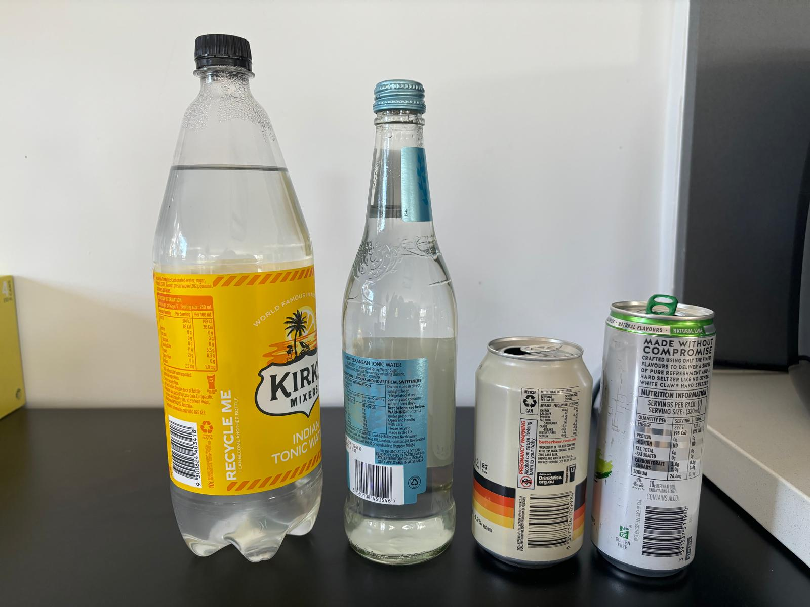
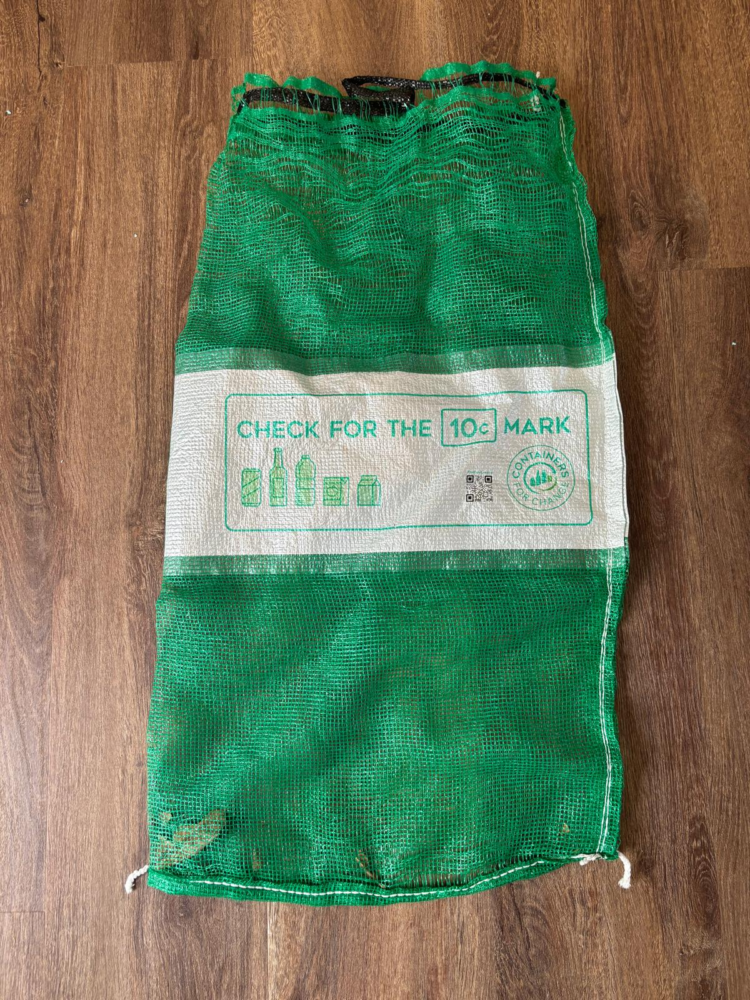
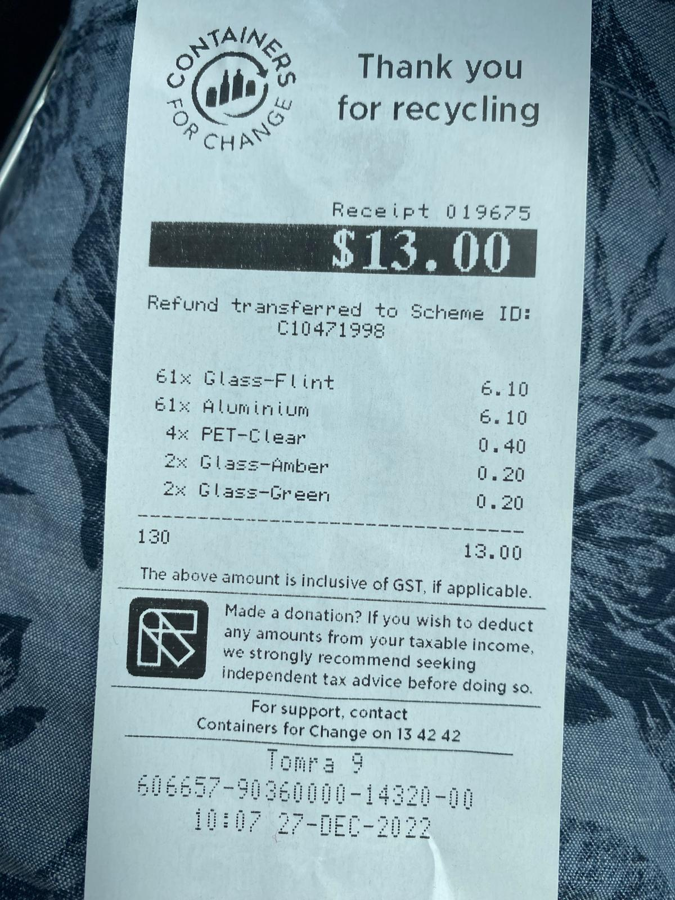
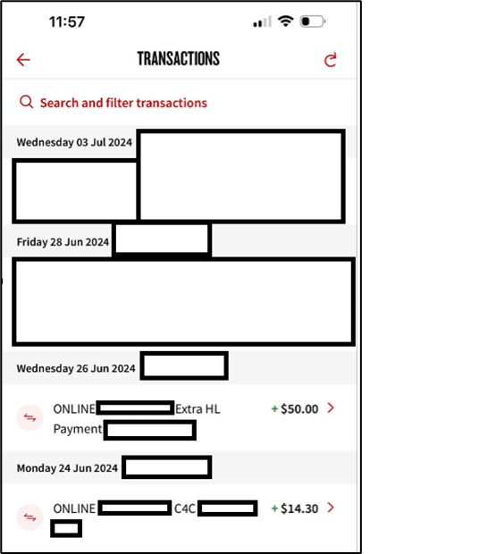

I don’t know about you or if I’m alone in this weird money habit quirk of mine… 

Containers for Change (C4C) as it known in Western Australia and Queensland or Return and Earn in New South Wales or whatever Container Deposit Scheme is called – it’s the 10c refund given to eligible containers for recycling them at official depots. 



I religiously save up my containers until I have about 2 bags full of containers before taking them to the recycling depot. I collect them from beers I’d drunk, soda drinks and even the kids’ juice and milk boxes. I store them in my green containers for change bags. 



This may seem irrational or strange but if I’m at a park having a quite Pepsi watching my kids, I make sure I bring home the container to add to the collection. I stop short of picking up other people’s containers I see on the ground and don’t add those to the collection. But you get the point. 

Every three to four weeks, sometimes sooner depending on whether my mates have come round to watch sport or not, I visit the depot and recycle the containers. Refunds have ranged from $7.40 to a whopping $40.10 after a birthday party.



It’s what I do next the I’m guessing most people don’t do… and it irritates my wife to no end. I make sure that when the refund reflects in or is deposited into my bank account, I automatically transfer it onto my mortgage with the reference or description: C4C. Every – Single – Time. 



Above is a snapshot on my recent mortgage activity. I also have a recurring $50 per week extra payment onto my mortgage but why would I make such a fuss about a measly $14.30 payment onto my mortgage? 

* ```
  **Firstly**, in the end, it will all add up and over time make a small and minor but a difference to my mortgage balance and the interest I pay on the loan. In the about 18 months since I’ve had my current property and mortgage, I’ve deposited a whopping $238.50 onto my mortgage – worth a staggering 2,385 containers recycled. If nothing else its great for the environment, right? 
  ```
* ```
  **Secondly**, it’s a constant reminder of my goal to be mortgage free one day, and this is part of the solution (obviously not the only solution) to pay it down faster. 
  ```
* ```
  **Lastly and probably the most important reason**: on a Saturday or Sunday arvo when I’m relaxing on my balcony or watching cricket or rugby and my wife asks me what I’m doing just sitting there drinking a beer…. I can wholeheartedly and without flinching say, “I’m paying off the mortgage”. 
  ```

**Disclaimer:** Before you flare up… This article in no way intends to promote excessive drinking of either alcoholic beverages, sugary drinking or milk. Everything is moderation. The intended purpose is to promote savings or debt reduction as a by-product of preexisting behaviours.

**Enjoyed this article? Help keep the blog up by donating here: https://www.buymeacoffee.com/wellbowledshane**
