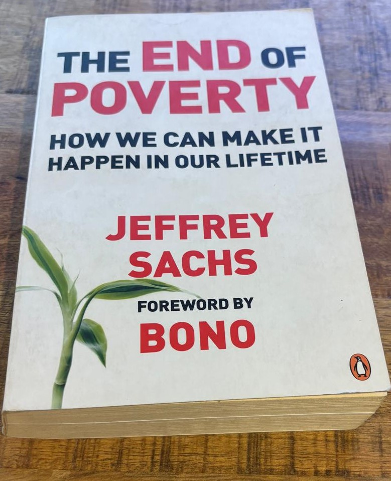
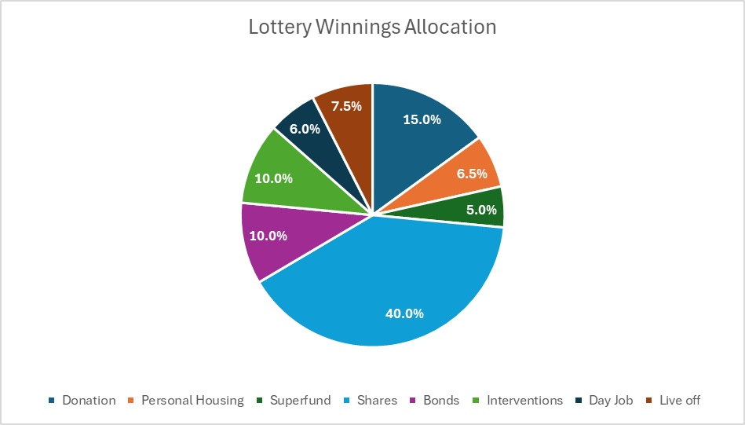

I don’t know about you but each time I buy a lottery ticket, which I admit is probably more often that it ought to be, I can’t hep but wonder what I would do with the winnings. I bought a ticket for the Powerball jackpots that was $100 million. Imagine what you could do with that amount of money…

If I won the $100 million lottery Powerball, this is what I’d do (you’ll soon realise If spent probably an unhealthy amount of time thinking about this).

Not many people would know I’d won. I’d tell my wife and that’s probably about it…initially. Can you imagine how many “new friends” you’ll have suddenly when you’re on the front page of the news having won $100 million. 

If you win the division 1 prize there usually is a validation period, which takes about 14 days. Thereafter you receive your winnings. I wouldn’t resign from my day job until the money was sitting in my bank account. Then I would promptly resign with zero notice period – **adios!**

My rational brain would force me to go out and secure the services of a top-notch financial advisor to assist me with planning and investing my winnings. This would definitely be my first action. 

Let’s say $100,000,000 is sitting in my bank account, I’d have a proper plan in place on how to allocate those funds, so I’d never have to worry about money again. I’d invest, save and spend it in different ways and have a blast. I’d have broad categories that I’d allocate the winnings to

I’d split my winnings over these categories: 

•	Donation 

•	Personal Housing 

•	Superfund 

•	Shares 

•	Bonds 

•	Day Job

•	Interventions

•	Live off

Firstly, I’d **donate** 15% of all the winnings. When I say donate I mean, give some to charities or causes that are close to my heart as well as share the money with my family and friends. Family and friends would receive 10% and two charities would receive $2,500,000 each and these charities would be [Kids Telethon Institute](https://www.telethonkids.org.au/), an independent not-for-profit, non-government organisation with close affiliations with the University of Western Australia and the Perth Children's Hospital and an organisation called [No Pup Cleft Behind](https://www.nopupcleftbehind.com/) – a puppy rescue organisation located in Western Australia. I’d also donate my time to these organisations, if they’d have me on their boards. 

**Personal housing**, I’d pay off my current mortgage. Buy a piece of land with an ocean view and build my dream house. I’d also buy a holiday house in the Margaret River region, probably Dunsborough – Gods Country that part of the world. This would be 6.5% of the winnings.

I’d put 2.5% into my partners and my **superfund** each. I’m naturally cautious and would see this as the ultimate risk aversion strategy. If it all goes belly up, and I lose all the money – at least my super will be there as a back-up. And importantly, it would not be a self-managed super fund, I’d let my super fund professionals manage and invest the funds. This is part of my diversification strategy.  

I’d invest $40 million into **listed shares**. 75 percent into ASX 300 listed shares and the rest into international shares. Most likely I’d invest it through a fund like Vanguard, iShares, Van Eck or BetaShares and let them manage the allocations according to their funds mandate. I’d make sure to reinvest distributions (after tax has been paid) back into the funds. 

I’d invest 10% into corporate and government **bonds** through an Australian bond fund. Importantly, through a different firm that would run the share investment. This should earn a steady coupon return if invested in high grade bonds.  

6 percent would then be used to set up my **‘day job**’. I’d form a fund that invested into new technology and research, both venture capital and angel investing. I’m unsure of the focus area but climate change initiatives seem like a worthy cause to tackle. I’d try to pull in other investors into the fund and make investments into early-stage ideas, concepts and technology in order to commercialise the businesses. By ‘day job’, I mean I’d be an advisor on the board of the fund and leave the actual venture capital value creation process to a professional venture capital team. 

I’d then take 10% of the winnings and invest into what I call **Interventions**. The inspiration for this is Jeffrey Sachs and in particular his book called: “End of Poverty, how we can make it happen in our lifetime.” If you ever get a chance to read this book, I highly recommend it. In his book Professor Sacks discusses a set of investments or interventions needed to end poverty. The general idea is that only a set (a number) of different targeted interventions can eradicate poverty. For example, sending a kid to school and neglecting housing, or food security will not yield the best results – that is poverty alleviation. 

So, making wholistic investments to target poverty should yield better results. With a $10 million fund to intervene, I’d target a small number of deserving families and invest in housing, schooling (for the kids), food security, skills development (for the parents) and health. How’d I select the families? I have no idea, but it would not involve the government, it would be funded directly and indirectly through not for profits. Something like this: Buy a house for a family to live in rent free for 3 years, send kids to good schools, send parents to vocational or university training, pay for food and health expenses. Enable the family to reset, retool, reskill and progress out of poverty, that is take themselves out of poverty. Time is limited so the family would need to commit and take advantage of the opportunity. I haven’t yet figured out to make this sustainable, so take it becomes self-funding. The $10 million will eventually run out. 

Lastly, I’d allocate $7.5 million to on **call deposits** at banks and other financial institutions to earn monthly interest to live off. These would be held at the largest and most stable banks to earn a steady income stream. Currently the rate at Macquarie I year investment term with interest paid out monthly would earn about $325,000. Yep, that’s an annual salary I can definitely see myself spending – especially since there would be now work involved. 

**The goal would be to balance philanthropic endeavours with ensuring that the lottery winnings last.** A target weighted earnings of 8% per annum across the investment categories should ensure a steady growth rate and enough to live comfortably – very comfortably. 

I’d spread the winnings across a number of asset classes, and across a number of different money managers. I’d diversify as much as I could to reduce the concentration risk that one advisor or money manager could lose it all in a bad bet, through mismanagement or in the worst-case fraud. 

I also think, that once I’ve invested the funds into their different areas. I’d take my family and friends on an epic holiday. Probably use some of the funds out of the call deposits to hire a plane to fly to Fiji of somewhere similar for a bit of R&R. 

**Disclaimer:** If you win the lottery Powerball jackpot – get financial advice from a professional, licensed and trusted financial planner. That’s what I’d do. This article is general nature only and has not taken into account your particular circumstances, objectives, financial situation or needs. You should consider whether the information, strategies and investments are appropriate and suitable for you or seek personal advice from a licensed financial planner before making an investment decision.

Sachs, J. 2005. The end of poverty, how we can make it happen in our lifetime. Penguin Books.

**Enjoyed this article? Help keep the blog up by donating here: https://www.buymeacoffee.com/wellbowledshane**
